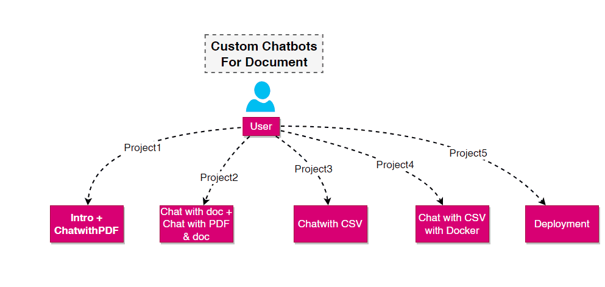

# ChainLit with LLMs 

## Table of Contents

- [Outline](#about)
- [Projects](#getting_started)
- [Usage](#usage)
- [Contributing](../CONTRIBUTING.md)

## Outline 



### Installing

---

Don't forget to set `.env` file for OpenAI key

A step-by-step series of examples that tell you how to get a development env running.

Say what the step will be

```bash
pip install -r requirements.txt
```

## Projects 

These instructions will get you a copy of the project up and running on your local machine for development and testing purposes. See [deployment](#deployment) for notes on how to deploy the project on a live system.

### Installations

What things you need to install the software and how to install them.

```bash
pip install -r requirements.txt
```

### Run

```bash
chainlit run Project1.py -w
chainlit run Project2.py -w
chainlit run Project3.py -w
chainlit run Project4.py -w
```
